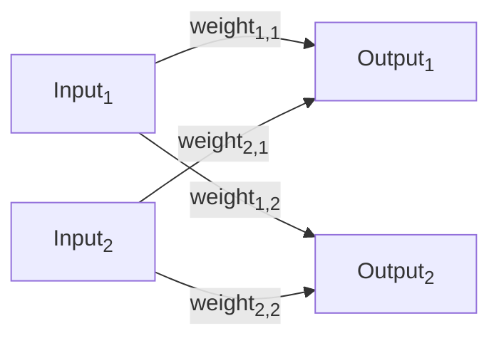
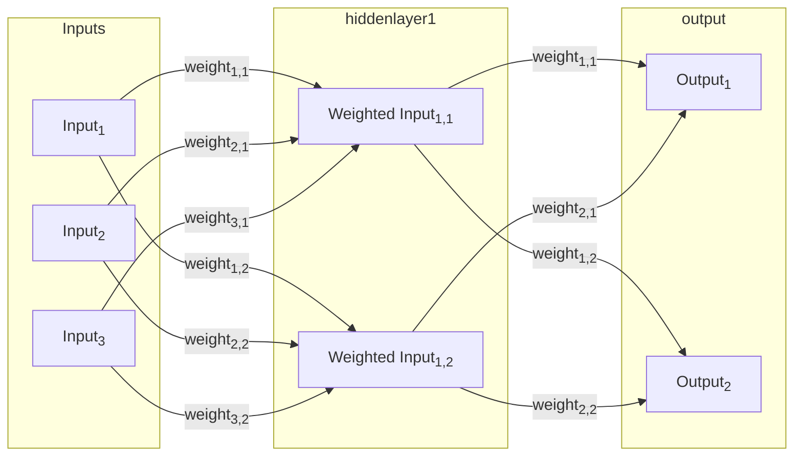

# Neural Network The Hard Way

## Basic assumptions


## Learning
Basic idea is (this applies to bias the same way but without the weight decay):
1. Have weights
    1. have an array of weightVelocities (explained below)
2. Have something called momentum
    1. This will act as a limiter on the velocity the weight will change
3. Have learn rate
    1. This will act on the cost gradient
4. learn_rate = learn_rate/(1+(learn_rate_decay * epoch #))
4. velocity = weightVelocities[i] * momentum - costGradientW[i] * learnRate;
5. weightDecay = (1 - regularization * learnRate);
6. new weights[i] = weight * weightDecay + velocity;

### Data

Data is in the following format:

```json
[
    {
        "key_1": "value_1",
        "key_2": "value_2",
        "key_3": "value_3",
        "key_4": "value_4",
        ...
        "expected_output": "value_n"
    },
    ...
]
```

## Basic Neural Network



* Output<sub>1</sub> = Input<sub>1</sub> * weight<sub>1,1</sub> + Input<sub>2</sub> * weight<sub>2,1</sub> + bias<sub>1</sub>
* Output<sub>2</sub> = Input<sub>1</sub> * weight<sub>1,2</sub> + Input<sub>2</sub> * weight<sub>2,2</sub> + bias<sub>2</sub>

## Neural Network with hidden layers


